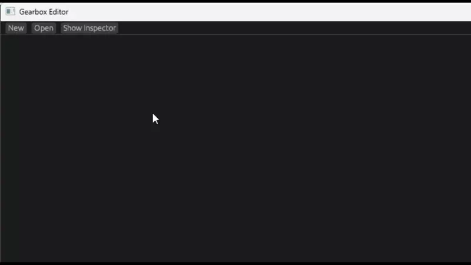

# bevy_gearbox_editor

Visual editor for bevy_gearbox state machines. Create states and transitions, arrange them spatially, and save/load as Bevy scenes.

> Note: This release is a significant departure from previous versions. There is no migration guide.

## Relationship to the runtime

- Built for the [`bevy_gearbox`](https://github.com/DEMIURGE-studio/bevy_gearbox) runtime. Use both together for the best experience.
- Author machines in the editor and load them at runtime with Bevy’s scene system.

## Demo

## Features

- Logical hierarchy editing (independent of the scene graph).
- Transition edges as first-class entities (event-driven, always, delayed).
- Entity inspection for states and transitions (bevy-inspector-egui integration).
- Scene save/load (`.scn.ron`).

## Basic controls

- Open editor window: press Ctrl+O. Right click the editor window to open the context menu and view or create state machines!
- Select: click a state node.
- Create a transition: select a state, click the blue “+”, click a target state, then pick an event (or “Always”).
- Inspect: right-click a state or a transition event pill → Inspect. The inspector allows you to view, add, and remove arbitrary reflected components. (Assuming they reflect Default)
- Delete: right-click → Delete.
- Move: drag nodes by clicking and dragging.

## See also

- [`bevy_gearbox`](https://github.com/DEMIURGE-studio/bevy_gearbox) — runtime library and semantics.

## License

Dual-licensed under MIT or Apache-2.0, at your option.
